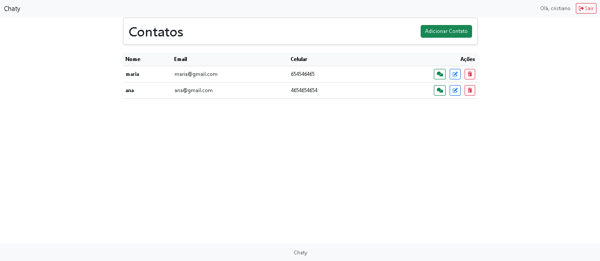

# 📚 Projeto Acadêmico - Sistema de Contatos (WEB-2)



**Trabalho desenvolvido para a disciplina Desenvolvimento Web II do curso de ADS no IFSC-Tubarão**

## 📝 Objetivo do Projeto

Implementar um sistema de gerenciamento de contatos com mensagens, aplicando os conceitos aprendidos na disciplina:
- Arquitetura MVC com Flask
- Operações CRUD
- Autenticação e autorização
- Relacionamentos entre entidades
- Templates dinâmicos

## 🎯 Requisitos Atendidos

### Conteúdo programático aplicado
✔ **Backend**: 
- Rotas e views
- Forms
- Sessões e autenticação
- Banco de dados (SQLAlchemy)

✔ **Frontend**:
- Templates com Jinja2
- Mensagens flash
- Interface responsiva

✔ **Extras**:
- Flask-Login para gestão de usuários
- Werkzeug para hash de senhas
- Relacionamentos 1-N e N-1

## 🧑‍💻 Tecnologias Utilizadas

| Área         | Tecnologias                          |
|--------------|--------------------------------------|
| Frontend     | HTML5, CSS3, Bootstrap, Jinja2       |
| Backend      | Python, Flask, SQLAlchemy            |
| Banco de Dados | SQLite            |
| Segurança    | Flask-Login, Werkzeug      |

## 📊 Diagrama de Entidades

```mermaid
classDiagram
    class User {
        +id: int
        +name: str
        +email: str
        +password: str
        +contatos: Contato[]
    }
    
    class Contato {
        +id: int
        +name: str
        +email: str
        +celular: str
        +user_id: int
        +mensagens: Mensagem[]
    }
    
    class Mensagem {
        +id: int
        +titulo: str
        +mensagem: str
        +data: datetime
        +contato_id: int
    }
    
    User "1" -- "n" Contato
    Contato "1" -- "n" Mensagem
